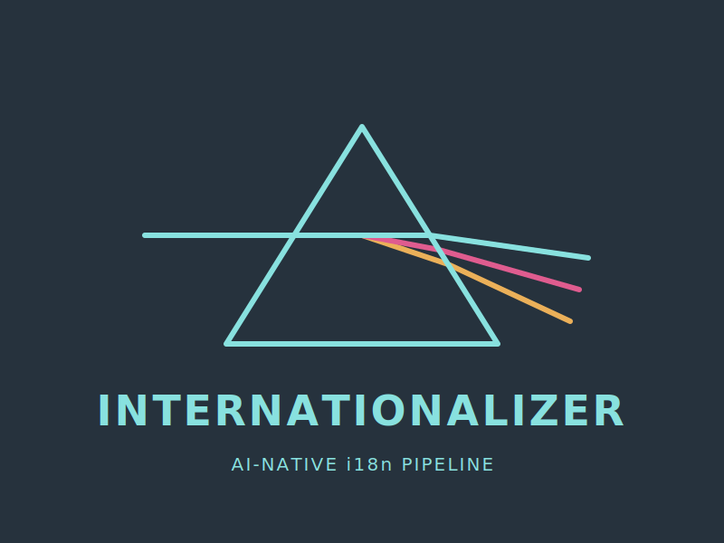

> [English (original)](../../README.md)

<p align="center">
  
</p>

# Internationalizer

Pipeline internasionalisasi berbasis AI untuk proyek perangkat lunak. Terjemahkan, validasi, dan kelola file i18n menggunakan LLM.

[](https://github.com/Tom-R-Main/Internationalizer/actions/workflows/ci.yml)
[](LICENSE)

## Mengapa Internationalizer?

Sebagian besar alat i18n adalah *runtime library* (i18next, react-intl) atau platform SaaS manajemen kunci (Crowdin, Lokalise). Tidak ada satupun yang menyelesaikan masalah terjemahan yang sebenarnya dengan baik:

- **Terjemahan manual** tidak dapat diskalakan untuk lebih dari beberapa bahasa
- **API terjemahan mesin** (Google Translate, DeepL) mengabaikan terminologi, nada, dan konvensi UI Anda
- **Terjemahan LLM generik** bekerja lebih baik, tetapi tanpa glosarium dan panduan gaya, Anda akan mendapatkan hasil yang tidak konsisten

Internationalizer berbeda. Ini adalah **pipeline CLI** yang menggabungkan terjemahan LLM dengan:

- **Glosarium per bahasa** — menerapkan terminologi yang konsisten di seluruh aplikasi Anda
- **Panduan gaya per bahasa** — mengontrol nada, formalitas, pluralisasi, dan tipografi
- **Memori terjemahan** — melewati string yang tidak berubah, menghemat biaya panggilan API
- **Validasi kunci** — menangkap terjemahan yang hilang dan ketidakcocokan interpolasi sebelum dirilis

## Instalasi

Instal dari npm:

```bash
npm install -g internationalizer
```

Atau jalankan tanpa instalasi global:

```bash
npx internationalizer --help
```

Paket npm menginstal biner bawaan yang cocok dari npm melalui dependensi opsional khusus platform.

Instal dengan Go:

```bash
go install github.com/Tom-R-Main/Internationalizer/cmd/internationalizer@latest
```

Atau bangun dari sumber:

```bash
git clone https://github.com/Tom-R-Main/Internationalizer.git
cd Internationalizer
go build -o internationalizer ./cmd/internationalizer
```

## Paket npm

- Tag Git dan versi paket npm harus cocok, misalnya `v0.1.0` dan `0.1.0`
- Paket `internationalizer` root bergantung pada paket platform seperti `internationalizer-darwin-arm64`
- Target npm yang didukung: macOS arm64/x64, Linux arm64/x64, Windows x64
- Publikasi CI memerlukan *secret* GitHub bernama `NPM_TOKEN`

## Mulai Cepat

1. Buat file konfigurasi di root proyek Anda:

```yaml
# .internationalizer.yml
source_locale: en
target_locales: [fr, de, es, ja]
source_path: locales/en.json

llm:
  provider: gemini
  model: gemini-3.1-pro-preview
  api_key_env: GOOGLE_AI_STUDIO_API_KEY
```

2. Atur kunci API Anda:

```bash
export GOOGLE_AI_STUDIO_API_KEY=your-ai-studio-key
```

3. Pratinjau apa yang akan diterjemahkan:

```bash
internationalizer translate --dry-run
```

4. Jalankan terjemahan:

```bash
internationalizer translate
```

5. Validasi semua lokal:

```bash
internationalizer validate
```

## Perintah

### `translate`

Temukan kunci yang hilang dan terjemahkan melalui LLM.

```bash
internationalizer translate                    # terjemahkan semua lokal
internationalizer translate -l fr              # terjemahkan bahasa Prancis saja
internationalizer translate --dry-run          # pratinjau tanpa panggilan API
internationalizer translate --batch-size 20    # batch lebih kecil
internationalizer translate --concurrency 2    # panggilan paralel lebih sedikit
```

### `validate`

Periksa semua file lokal untuk kunci yang hilang, kunci ekstra, dan ketidakcocokan interpolasi.

```bash
internationalizer validate                     # output yang dapat dibaca manusia
internationalizer validate --json              # JSON yang dapat dibaca mesin
internationalizer validate -q                  # hanya kode keluar
```

### `detect`

Deteksi otomatis framework i18n dan sarankan konfigurasi.

```bash
internationalizer detect
```

Mendukung: react-i18next, next-intl, vue-i18n, vanilla JSON, dokumen markdown.

### `glossary`

Kelola istilah glosarium per bahasa yang diterapkan selama penerjemahan.

```bash
internationalizer glossary list --locale fr
internationalizer glossary add --locale fr --source "Dashboard" --target "Tableau de bord"
internationalizer glossary remove --locale fr --source "Dashboard"
```

### `tm`

Kelola memori terjemahan (cache JSONL dari string yang diterjemahkan sebelumnya).

```bash
internationalizer tm stats                     # tampilkan jumlah catatan
internationalizer tm export                    # dump sebagai JSON
internationalizer tm clear --force             # hapus semua catatan
```

## Referensi Konfigurasi

```yaml
# .internationalizer.yml

# Bahasa sumber (default: en)
source_locale: en

# Bahasa tujuan terjemahan (wajib)
target_locales: [fr, de, es, ja, zh-CN, ar]

# Jalur ke file lokal sumber (wajib)
source_path: locales/en.json

# Pengaturan penyedia LLM
llm:
  # Penyedia: "anthropic", "openai", "gemini", atau "openrouter" (default: gemini)
  provider: gemini

  # Nama model default berdasarkan penyedia:
  #   anthropic:  claude-sonnet-4-6
  #   openai:     gpt-5.4
  #   gemini:     gemini-3.1-pro-preview
  #   openrouter: google/gemini-3-flash-preview
  model: gemini-3.1-pro-preview

  # Variabel lingkungan yang berisi kunci API
  api_key_env: GOOGLE_AI_STUDIO_API_KEY

  # URL dasar untuk endpoint yang kompatibel dengan OpenAI (opsional)
  # base_url: https://api.openai.com

# Kunci per panggilan LLM (default: 40)
batch_size: 40

# Panggilan LLM paralel (default: 4)
concurrency: 4

# Direktori yang berisi file Markdown panduan gaya per lokal (default: style-guides)
style_guides_dir: style-guides

# Direktori yang berisi file JSON glosarium per lokal (default: glossary)
glossary_dir: glossary

# Jalur ke file memori terjemahan (default: .internationalizer/tm.jsonl)
tm_path: .internationalizer/tm.jsonl
```

## Panduan Gaya

Panduan gaya adalah file Markdown yang disuntikkan ke dalam prompt terjemahan LLM. Panduan ini mengontrol nada, formalitas, tipografi, dan konvensi khusus bahasa lainnya.

```
style-guides/
  _conventions.md    # aturan bersama untuk semua bahasa
  fr.md              # aturan khusus bahasa Prancis
  ja.md              # aturan khusus bahasa Jepang
  ar.md              # aturan khusus bahasa Arab
```

### Konvensi bersama (`_conventions.md`)

Tentukan aturan yang berlaku untuk semua bahasa: sintaks interpolasi, pelestarian HTML, konvensi tipe string (tombol vs. label vs. error), dll.

### Panduan per bahasa (`{locale}.md`)

Tentukan aturan khusus bahasa: tingkat formalitas (tu vs. vous), tanda baca (guillemet, tanda tanya terbalik), bentuk jamak, pemformatan tanggal/angka, dan glosarium terminologi.

Lihat [`examples/react-app/style-guides/`](examples/react-app/style-guides/) untuk contoh yang berfungsi.

## Format Glosarium

File glosarium adalah array JSON yang disimpan di `{glossary_dir}/{locale}.json`:

```json
[
  {
    "source": "Dashboard",
    "target": "Tableau de bord",
    "ignore_case": false,
    "whole_word": true
  }
]
```

Istilah disuntikkan ke dalam prompt LLM sebagai tabel terminologi, memastikan terjemahan istilah kunci yang konsisten di seluruh aplikasi Anda.

## Memori Terjemahan

Memori terjemahan disimpan sebagai file JSONL (satu catatan JSON per baris). Setiap catatan berisi:

- Kunci dan nilai sumber
- Nilai yang diterjemahkan
- Hash SHA-256 dari nilai sumber
- Stempel waktu

Pada proses berikutnya, string yang tidak berubah disajikan dari cache TM tanpa memanggil LLM, menghemat waktu dan biaya API. File TM ramah-git dan dapat di-commit bersama file lokal Anda.

## Format yang Didukung

| Format | Ekstensi | Mode |
|--------|-----------|------|
| JSON | `.json` | Key-value (bersarang, diratakan dengan notasi titik) |
| YAML | `.yml`, `.yaml` | Key-value (mempertahankan komentar dan urutan) |
| Markdown | `.md`, `.mdx` | Terjemahan seluruh dokumen |

## Deteksi Jenis Proyek

`internationalizer detect` mengidentifikasi pengaturan i18n Anda dengan memeriksa:

- Dependensi `package.json` untuk react-i18next, next-intl, atau vue-i18n
- Struktur direktori yang cocok dengan pola lokal umum
- Ekstensi file dan konvensi penamaan

## Arsitektur

```
cmd/internationalizer/     Titik masuk CLI dan definisi perintah
internal/
  config/                  Pemuatan konfigurasi YAML dengan default
  detect/                  Deteksi otomatis jenis proyek
  formats/                 Parser format (JSON, YAML, Markdown)
  glossary/                Manajemen glosarium per lokal
  llm/                     Antarmuka penyedia LLM + implementasi
    anthropic.go           Backend Anthropic Claude
    openai.go              Backend OpenAI / kompatibel
    gemini.go              Backend Google Gemini via AI Studio
                           OpenRouter menggunakan openai.go dengan base_url kustom
  styleguide/              Pemuat panduan gaya
  tm/                      Memori terjemahan JSONL
  translate/               Orkestrator terjemahan
  validate/                Validasi lokal dan diffing
```

## Perbandingan dengan Alternatif

| Fitur | Internationalizer | i18next | Crowdin | LLM Generik |
|---------|------------------|---------|---------|-------------|
| Terjemahan bertenaga LLM | Ya | Tidak | Sebagian | Ya |
| Panduan gaya per bahasa | Ya | Tidak | Tidak | Tidak |
| Penerapan glosarium | Ya | Tidak | Ya | Tidak |
| Memori terjemahan | Ya | Tidak | Ya | Tidak |
| Eksekusi CLI / lokal | Ya | N/A | Tidak | Manual |
| File ramah-Git | Ya | Ya | Sebagian | Manual |
| Tanpa dependensi SaaS | Ya | Ya | Tidak | Bervariasi |
| Open source (AGPL-3.0) | Ya | Ya | Tidak | Bervariasi |

## Lisensi

[AGPL-3.0](LICENSE)

## Berkontribusi

Lihat [CONTRIBUTING.md](CONTRIBUTING.md) untuk pengaturan pengembangan dan panduan. Semua kontribusi memerlukan persetujuan DCO.

