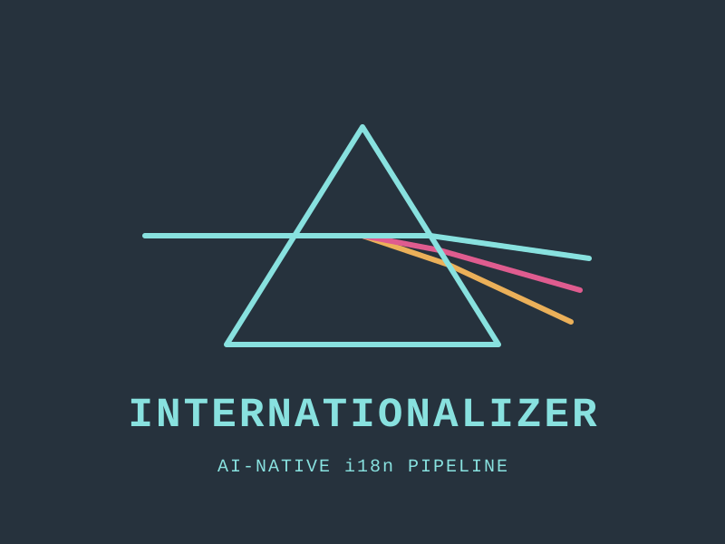

> [English (original)](../../README.md)

<p align="center">
  
</p>

# Internationalizer

AI-нативний конвеєр інтернаціоналізації для програмних проєктів. Перекладайте, перевіряйте та керуйте файлами i18n за допомогою LLM.

[](https://github.com/Tom-R-Main/Internationalizer/actions/workflows/ci.yml)
[](../../LICENSE)

<p align="center">
<a href="ar.md">العربية</a> · <a href="bn.md">বাংলা</a> · <a href="cs.md">Čeština</a> · <a href="da.md">Dansk</a> · <a href="de.md">Deutsch</a> · <a href="el.md">Ελληνικά</a> · <a href="es.md">Español</a> · <a href="fi.md">Suomi</a> · <a href="fr.md">Français</a> · <a href="he.md">עברית</a> · <a href="hi.md">हिन्दी</a> · <a href="id.md">Indonesia</a> · <a href="it.md">Italiano</a> · <a href="ja.md">日本語</a> · <a href="ko.md">한국어</a> · <a href="ms.md">Bahasa Melayu</a><br><a href="nl.md">Nederlands</a> · <a href="pa.md">ਪੰਜਾਬੀ</a> · <a href="pl.md">Polski</a> · <a href="pt-BR.md">Português</a> · <a href="ro.md">Română</a> · <a href="ru.md">Русский</a> · <a href="sv.md">Svenska</a> · <a href="te.md">తెలుగు</a> · <a href="th.md">ไทย</a> · <a href="tr.md">Türkçe</a> · <a href="uk.md">Українська</a> · <a href="vi.md">Tiếng Việt</a> · <a href="yue.md">粵語</a> · <a href="zh-CN.md">简体中文</a> · <a href="zh-TW.md">繁體中文</a>
</p>

---

<!-- internationalizer:unit markdown:why-internationalizer -->
## Чому Internationalizer?

Більшість інструментів i18n — це або бібліотеки часу виконання (i18next, react-intl), або SaaS-платформи для керування ключами (Crowdin, Lokalise). Жоден із них не розв'язує належним чином саме завдання перекладу:

- **Ручний переклад** не масштабується, якщо мов більше кількох
- **API машинного перекладу** (Google Translate, DeepL) ігнорують вашу термінологію, тон і конвенції інтерфейсу користувача
- **Звичайний переклад за допомогою LLM** працює краще, але без глосаріїв і посібників зі стилю дає неузгоджені результати

Internationalizer влаштований інакше. Це **конвеєр CLI**, що поєднує переклад за допомогою LLM із такими можливостями:

- **Глосарії для окремих мов** — забезпечують узгоджену термінологію в усьому застосунку
- **Посібники зі стилю для окремих мов** — контролюють тон, формальність, форми множини й типографіку
- **Пам'ять перекладів** — пропускає незмінені рядки, заощаджуючи кошти на викликах API
- **Детермінована валідація** — виявляє відсутні чи зайві ключі, порушення захищеної структури, невідповідності глосарію, а також помилки у формах множини або ICU ще до релізу

<!-- internationalizer:unit markdown:installation -->
## Встановлення

Встановлення з npm:

```bash
npm install -g internationalizer
```

Або запуск без глобального встановлення:

```bash
npx internationalizer --help
```

Пакет npm встановлює відповідний скомпільований бінарний файл з npm через платформні необов'язкові залежності.

Встановлення за допомогою Go:

```bash
go install github.com/Tom-R-Main/Internationalizer/cmd/internationalizer@latest
```

Або збирання з вихідного коду:

```bash
git clone https://github.com/Tom-R-Main/Internationalizer.git
cd Internationalizer
go build -o internationalizer ./cmd/internationalizer
```

<!-- internationalizer:unit markdown:npm-packages -->
## Пакети npm

- Теги Git і версії пакетів npm мають збігатися, наприклад `v0.1.0` та `0.1.0`
- Кореневий пакет `internationalizer` залежить від платформних пакетів, таких як `internationalizer-darwin-arm64`
- Підтримувані цільові платформи npm: macOS arm64/x64, Linux arm64/x64, Windows x64
- Для публікації через CI потрібен секрет GitHub з назвою `NPM_TOKEN`

<!-- internationalizer:unit markdown:quick-start -->
## Швидкий початок

1. Створіть конфігураційний файл у корені вашого проєкту:

```yaml
# .internationalizer.yml
source_locale: en
target_locales: [fr, de, es, ja]
bundles:
  - id: app
    source: locales/en.json
    target: locales/{locale}.json
    format: json

llm:
  provider: gemini
  model: gemini-3.8-flash
  api_key_env: GOOGLE_AI_STUDIO_API_KEY
```

2. Задайте свій ключ API:

```bash
export GOOGLE_AI_STUDIO_API_KEY=your-ai-studio-key
```

3. Перегляньте попередній список рядків для перекладу:

```bash
internationalizer translate --dry-run
```

4. Запустіть переклад:

```bash
internationalizer translate
```

5. Перевірте всі локалі:

```bash
internationalizer validate
```

<!-- internationalizer:unit markdown:commands -->
## Команди

### `translate`

Знайти відсутні або застарілі ключі та перекласти їх за допомогою LLM.

```bash
internationalizer translate                    # translate all locales
internationalizer translate -l fr              # translate French only
internationalizer translate --dry-run          # preview without API calls
internationalizer translate --adopt-existing   # baseline existing translations without API calls
internationalizer translate --refresh-policy   # refresh prompt/style/model-stale entries
internationalizer translate --batch-size 20    # smaller batches
internationalizer translate --concurrency 2    # fewer parallel calls
```

Стан перекладу незалежно фіксує відсутні (missing), застарілі через зміну джерела (source-stale), застарілі через зміну політики (policy-stale), актуальні (current) та відредаговані вручну (manually edited) умови, тому ручне редагування не приховає зміну вихідного тексту чи політики. Значення із застарілою політикою відображаються у звіті, але повторно перекладаються лише з параметром `--refresh-policy`. Змінені вручну значення ніколи не перезаписуються автоматично. Використовуйте `--adopt-existing` під час першого підключення маніфесту до вже перевірених перекладів або щоб явно затвердити перевірене ручне редагування як новий базовий стан.

### `validate`

Перевірити всі файли локалей на відповідність вихідним бандлам. За замовчуванням валідація перевіряє структурне покриття (відсоток наявних обов'язкових цільових ключів), повідомляє про зайві ключі як про попередження та завершується помилкою в разі відсутності ключів, невідповідності інтерполяції чи некоректної структури ICU MessageFormat.

```bash
internationalizer validate                     # human-readable output
internationalizer validate --json              # machine-readable JSON
internationalizer validate -q                  # exit code only
internationalizer validate --strict             # enforce translation quality rules
internationalizer validate --require-state      # require current manifest provenance
```

Параметр `--strict` також звітує про якісне покриття перекладу. Лінгвістичне значення, ідентичне до вихідного, вважається неперекладеним, якщо тільки глосарій явно не містить точного запису з однаковим джерелом і цільовим значенням для всього рядка; параметр `ignore_case` враховується, але входження терміна з глосарія у довший рядок не звільняє його від перекладу. Суворий режим завершується помилкою за наявності зайвих ключів, значень, ідентичних до вихідних, зміненої структури інтерполяції, HTML, коду чи посилань Markdown, порушень глосарія та невідповідностей налаштованим формам множини.

Параметр `--require-state` перевіряє кожен цільовий переклад за файлом `.internationalizer.lock`. Він завершується помилкою, якщо ключ не відстежується або якщо зафіксований для нього хеш вихідного тексту, політики перекладу чи цільового значення застарів. Його можна поєднувати з `--strict`.

У звітах для користувача та у форматі JSON застосовуються стабільні коди проблем:

| Код | Значення |
| --- | --- |
| `missing_key` / `extra_key` | Набори ключів у вихідному та цільовому файлах різняться |
| `blank_translation` | Непорожнє вихідне значення має порожній цільовий переклад у суворому режимі |
| `source_identical` | У суворому режимі лінгвістичне значення залишилося неперекладеним |
| `protected_structure_mismatch` | Змінено структуру інтерполяції, HTML, коду або посилань |
| `glossary_violation` | Затвердженого цільового терміна або його варіанта не знайдено |
| `plural_form_missing` | Відсутня налаштована форма множини для цільової локалі |
| `icu_message_syntax` | Помилка синтаксису повідомлення ICU у вихідному або цільовому рядку |
| `icu_argument_mismatch` | Відрізняються імена аргументів ICU, їхні типи або стилі форматування |
| `icu_selector_mismatch` | Селектори різняться або категорія множини є неприпустимою для цільової локалі |
| `untracked` | У маніфесті відсутній запис для цільового елемента |
| `source_stale` | Вихідний вміст змінився після зафіксованого перекладу |
| `policy_stale` | Змінилися згенерований промпт або налаштування моделі |
| `target_modified` | Вміст цільового перекладу відрізняється від запису в маніфесті |

### `detect`

Автоматично визначити фреймворк i18n і запропонувати конфігурацію.

```bash
internationalizer detect
```

Підтримуються: react-i18next, next-intl, vue-i18n, стандартний JSON, документація у форматі Markdown.

### `glossary`

Керування термінами глосарія для окремих мов, дотримання яких забезпечується під час перекладу.

```bash
internationalizer glossary list --locale fr
internationalizer glossary add --locale fr --source "Dashboard" --target "Tableau de bord"
internationalizer glossary remove --locale fr --source "Dashboard"
```

### `tm`

Керування пам'яттю перекладів (кеш раніше перекладених рядків у форматі JSONL).

```bash
internationalizer tm stats                     # show record counts
internationalizer tm export                    # dump as JSON
internationalizer tm clear --force             # delete all records
```

<!-- internationalizer:unit markdown:configuration-reference -->
## Довідник із конфігурації

```yaml
# .internationalizer.yml

# Source language (default: en)
source_locale: en

# Languages to translate into (required)
target_locales: [fr, de, es, ja, yue, zh-CN, zh-TW, ar]

# One or more source-to-target mappings (required).
# {locale} is replaced with each configured target locale.
bundles:
  - id: app
    source: locales/en.json
    target: locales/{locale}.json
    format: json
  - id: docs
    source: README.md
    target: docs/i18n/{locale}.md
    format: markdown

# Backward compatibility: source_path still maps targets to sibling files
# such as locales/fr.json. Prefer bundles for new projects.
# source_path: locales/en.json

# LLM provider settings
llm:
  # Provider: "anthropic", "openai", "gemini", or "openrouter" (default: gemini)
  provider: gemini

  # Model name defaults by provider:
  #   anthropic:  claude-opus-5
  #   openai:     gpt-5.6-luna (reasoning effort defaults to max)
  #   gemini:     gemini-3.8-flash
  #   openrouter: deepseek/deepseek-v4-pro-0813
  model: gemini-3.8-flash

  # Environment variable containing the API key
  api_key_env: GOOGLE_AI_STUDIO_API_KEY

  # Base URL for OpenAI-compatible endpoints (optional)
  # base_url: https://api.openai.com

  # OpenAI GPT-5-series Responses API reasoning effort
  # (default: max for the OpenAI provider)
  reasoning_effort: max

  # Optional LLM settings for individual target locales. An override using the
  # global provider inherits unspecified global settings. A different provider
  # uses that provider's defaults for unspecified settings.
  locale_overrides:
    yue:
      provider: openrouter
      model: deepseek/deepseek-v4-flash-0731
      api_key_env: OPENROUTER_API_KEY
    zh-CN:
      provider: openrouter
      model: deepseek/deepseek-v4-flash-0731
      api_key_env: OPENROUTER_API_KEY
    zh-TW:
      provider: openrouter
      model: deepseek/deepseek-v4-flash-0731
      api_key_env: OPENROUTER_API_KEY

# Keys per LLM call (default: 40)
batch_size: 40

# Parallel LLM calls (default: 4)
concurrency: 4

# Directory containing per-locale style guide Markdown files (default: style-guides)
style_guides_dir: style-guides

# Directory containing per-locale glossary JSON files (default: glossary)
glossary_dir: glossary

# Path to translation memory file (default: .internationalizer/tm.jsonl)
tm_path: .internationalizer/tm.jsonl

# Versioned source, policy, target, and provenance state
# (default: .internationalizer.lock; commit this file)
manifest_path: .internationalizer.lock

# Optional translation and strict-validation rules
validation:
  plural_style: i18next-v4 # generate and validate target-locale plural forms
```

Ідентифікатори локалей мають бути коректними тегами BCP 47, такими як `fr`, `pt-BR` або `sr-Latn-RS`. Канонічно еквівалентні цільові локалі відхиляються як дублікати, а перевизначення провайдера для окремих локалей зіставляється за канонічно еквівалентним написанням. У наведеному вище прикладі локалі без перевизначення (зокрема японська) успадковують глобальну конфігурацію Gemini.

Значення ICU MessageFormat аналізуються структурно. Підтримуються прості аргументи, `select`, `plural`, `selectordinal`, `number`, `date` і `time`, зокрема вкладені повідомлення, зміщення множини (plural offsets), селектори точних чисел та `#`. Валідація перевіряє синтаксис, типи аргументів і стилі форматування, зміщення множини, збіг гілок select та категорії множини CLDR цільової локалі. Відповіді провайдера, які порушують ці інваріанти, відхиляються до запису у файл локалі або в пам'ять перекладів.

За використання `i18next-v4` розпізнані групи форм множини вихідної мови розгортаються під час перекладу у відповідні категорії CLDR цільової локалі. Якщо категорія наявна лише в цільовій мові, як шаблон перекладу використовується значення `_other` вихідної групи. Сувора валідація вимагає наявності таких цільових категорій; категорії, властиві лише вихідній мові, є необов'язковими для цільових локалей, де вони не використовуються.

<!-- internationalizer:unit markdown:style-guides -->
## Посібники зі стилю

Посібники зі стилю — це файли Markdown, які додаються до промпту перекладу для LLM. Вони контролюють тон, формальність, типографіку та інші мовні конвенції.

```
style-guides/
  _conventions.md    # shared rules for all languages
  fr.md              # French-specific rules
  ja.md              # Japanese-specific rules
  ar.md              # Arabic-specific rules
```

### Спільні конвенції (`_conventions.md`)

Визначають правила, що застосовуються до всіх мов: синтаксис інтерполяції, збереження HTML, конвенції щодо типів рядків (кнопки, мітки, помилки тощо).

### Посібники для окремих мов (`{locale}.md`)

Визначають специфічні для мови правила: регістр формальності (наприклад, звернення на «ти» чи «ви»), пунктуацію («лапки-ялинки», перевернуті знаки питання), форми множини, форматування дат і чисел, а також глосарій термінології.

Посібники зі стилю є сталими вхідними правилами політики, а не згенерованим результатом. Internationalizer читає їх, але ніколи не змінює. Їхній вміст хешується окремо від глосарія та контракту промпту, тому зміна коду застосунку не робить переклад застарілим. Редагування посібника зумисно позначає цю локаль як таку, що потребує перегляду політики; зміна внутрішніх формулювань промпту до цього не призводить, якщо не змінилася версія контракту промпту.

Практичний приклад див. у каталозі [`examples/react-app/style-guides/`](../../examples/react-app/style-guides/).

<!-- internationalizer:unit markdown:glossary-format -->
## Формат глосарія

Файли глосаріїв — це масиви JSON, які зберігаються за шляхом `{glossary_dir}/{locale}.json`:

```json
[
  {
    "source": "Dashboard",
    "target": "Tableau de bord",
    "variants": ["Panneau de contrôle"],
    "enforcement": "error",
    "ignore_case": false,
    "whole_word": true
  }
]
```

Поле `variants` перелічує інші затверджені цільові форми. `enforcement` може приймати значення `error`, `warning` або бути пропущеним (за замовчуванням діє поведінка помилки). Терміни додаються в промпт для LLM у вигляді таблиці термінології, що гарантує послідовний переклад у всьому застосунку. Точний запис на кшталт `{"source":"API","target":"API"}` також звільняє це повне ідентичне до джерела значення від зауважень суворого режиму щодо неперекладених значень; він не звільняє довший рядок, який просто містить `API`.

<!-- internationalizer:unit markdown:translation-memory -->
## Пам'ять перекладів

Пам'ять перекладів зберігається у вигляді файлу JSONL (один запис JSON на рядок). Кожен запис містить:

- Бандл, ключ, вихідне значення, перекладене значення та канонічну цільову локаль
- Хеші вихідного вмісту, посібника зі стилю, глосарія, контракту промпту та об'єднаної політики
- Назву провайдера й моделі, за допомогою яких створено переклад
- Позначку часу

Під час наступних запусків рядки з однаковими хешами вихідного тексту та політики беруться з кешу без звернення до LLM. За замовчуванням файл розміщується в ігнорованому каталозі `.internationalizer/`, тому залишається локальним кешем. Вкажіть для `tm_path` шлях, що відстежується системою контролю версій, якщо у вашому проєкті передбачено спільне використання пам'яті перекладів. Маніфест `.internationalizer.lock`, призначений для код-рев'ю, версіонується окремо.

<!-- internationalizer:unit markdown:supported-formats -->
## Підтримувані формати

| Формат | Розширення | Режим |
|---|---|---|
| JSON | `.json` | «Ключ — значення» (вкладені структури, розгортання через крапкову нотацію) |
| YAML | `.yml`, `.yaml` | «Ключ — значення» (збереження коментарів і порядку) |
| Markdown | `.md`, `.mdx` | Преамбула та розділи рівня H2 |

Цільові файли Markdown містять невидимі коментарі `internationalizer:unit` перед розділами рівня H2. Завдяки цим стабільним маркерам Internationalizer може додавати, переміщувати або редагувати окремий розділ вихідного тексту без повторного перекладу незв'язаних розділів. Документи, у яких маркерів ще немає, отримують їх під час наступного успішного оновлення.

<!-- internationalizer:unit markdown:project-type-detection -->
## Визначення типу проєкту

Команда `internationalizer detect` визначає конфігурацію i18n за такими ознаками:

- залежності в `package.json` на наявність react-i18next, next-intl або vue-i18n;
- структура директорій, що відповідає поширеним шаблонам розміщення локалей;
- розширення файлів і правила їх найменування.

<!-- internationalizer:unit markdown:architecture -->
## Архітектура

```
cmd/internationalizer/     CLI entry point and command definitions
internal/
  config/                  YAML config loading with defaults
  detect/                  Project type auto-detection
  formats/                 Format parsers (JSON, YAML, Markdown)
  glossary/                Per-locale glossary management
  llm/                     LLM provider interface + implementations
    anthropic.go           Anthropic Claude backend
    openai.go              OpenAI / compatible backend
    gemini.go              Google Gemini via AI Studio backend
                           OpenRouter uses openai.go with custom base_url
  locale/                  BCP 47 identity and CLDR plural categories
  message/                 ICU MessageFormat parser and structural comparison
  policy/                  Stable translation-policy hashing
  state/                   Versioned translation manifest
  styleguide/              Style guide loader
  tm/                      JSONL translation memory
  translate/               Translation orchestrator
  validate/                Locale validation and diffing
```

<!-- internationalizer:unit markdown:comparison-to-alternatives -->
## Порівняння з альтернативами

| Можливість | Internationalizer | i18next | Crowdin | Звичайні LLM |
|---|---|---|---|---|
| Переклад за допомогою LLM | Так | Ні | Частково | Так |
| Посібники зі стилю для окремих мов | Так | Ні | Ні | Ні |
| Застосування глосарія | Так | Ні | Так | Ні |
| Пам'ять перекладів | Так | Ні | Так | Ні |
| CLI / локальний запуск | Так | Н/Д | Ні | Вручну |
| Зручні для Git файли | Так | Так | Частково | Вручну |
| Без залежності від SaaS | Так | Так | Ні | Різниться |
| Відкритий вихідний код (AGPL-3.0) | Так | Так | Ні | Різниться |

<!-- internationalizer:unit markdown:license -->
## Ліцензія

[AGPL-3.0](../../LICENSE)

Відомості про сторонні залежності див. у файлі [THIRD_PARTY_NOTICES.md](../../THIRD_PARTY_NOTICES.md).

<!-- internationalizer:unit markdown:contributing -->
## Внесок у проєкт

Інструкції щодо налаштування середовища розробки та вказівки див. у файлі [CONTRIBUTING.md](../../CONTRIBUTING.md). Усі внески потребують підписання DCO.
